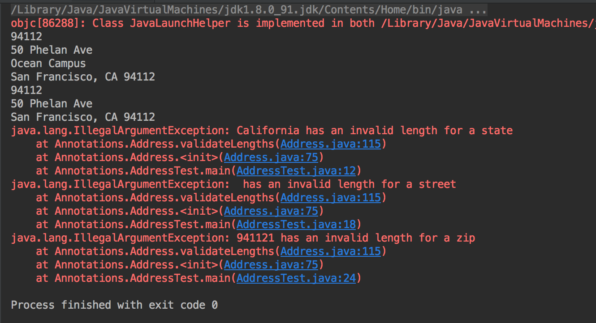

# String-Annotations-for-Addresses
A custom annotation called 'ProperLength' for String fields in the Address Class.  The length of characters are validated using reflections

## Requirements
- [x] Write an annotation called ProperLength that is meant to describe the required length of String input. Here are the requirements for the annotation:
   - This annotation has two elements: min length and max length.
     - The default min is 1, the default max is 255.
     - The annotation is meant for fields (instance data variables) only.
    
- [x] Apply this annotation to some or all the fields of the provided Address class, with these specifications:
   - street must not be empty and can be a max of 255
   - street2 has no restrictions (it can be empty and there is no max)
   - city must not be empty and can be a max of 255
   - state must be exactly 2 characters long
   - zip must be exactly 5 characters long
- [x] After applying the annotation, implement the validateLengths method.
   - This method uses reflection to look over all fields in the Address class and validate them using the annotation.
   - If a field has invalid length, an exception is thrown.

## Output
 
